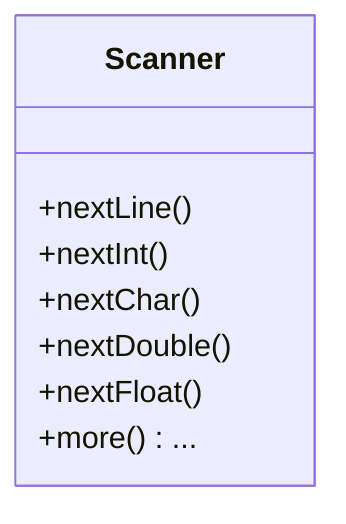

# Scanner类

使用`Scanner`对象与`System.in`构造参数来收集用户在控制台中的输入

## Scanner类的方法

- `next()`:收集在终端输入的在换行符、空格之前的内容
- `nextLine()`:收集在终端输入的同一行内的所有内容
- `nextInet()`:收集在终端中输入的内容，并且转换为Int格式，如无法转换则抛出异常
- `nextChar()`:收集在终端中输入的内容，并且只收集第一位字符转换为char格式
- `nextDouble()`:收集在终端中输入的内容，并且转服为Double格式，如果无法转换则抛出异常与

> `nextDouble()`与`nextFloat()`大致相同，双精度变成了浮点型

